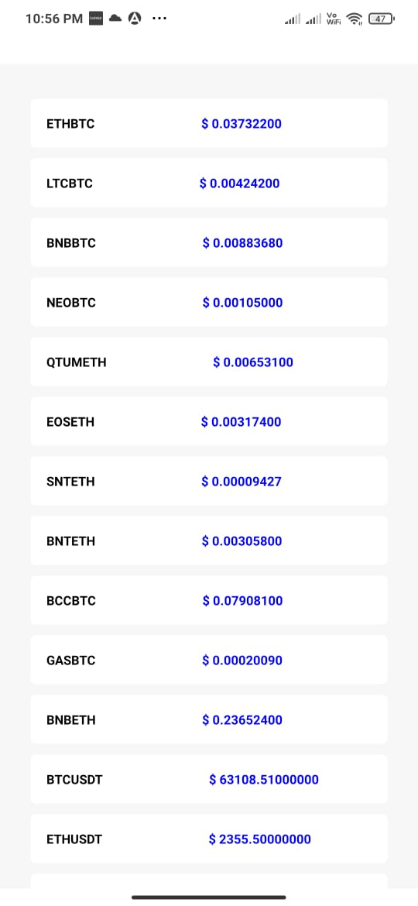

### README
The repository contains the project given by 'AsknBid' company as a test for internship.  
A Screen of the app called 'CoinMarketPlace' was to be implemented and 'ticker endPoint' was specified for fetching the data from 'Binance Api'
 which gives us stock symbol and price as the response .  
 Then the data was to be displayed in a list .  
 
 ### CURRENT PROGRESS
 I have successfully fetched the data from 'Binance Api' and displayed it in flatList View in react-native app.  
 
 ### MAIN SCREEN 
 The Main Screen of app looks like this: 
 
  

 ### TODO
 **SORTING**: I will add sorting button on the top which will allow the user the sort the list according to price .  
 **SEARCHBAR** : The user will be able to search the desired company from the search bar .  
 Many other features like **Shimmer Effect , Company Name , Company Image , Graph , 24hr high and low , AddToFavourite** etc could not be completed due to limited time but i will surely add these features in future.
 
 
